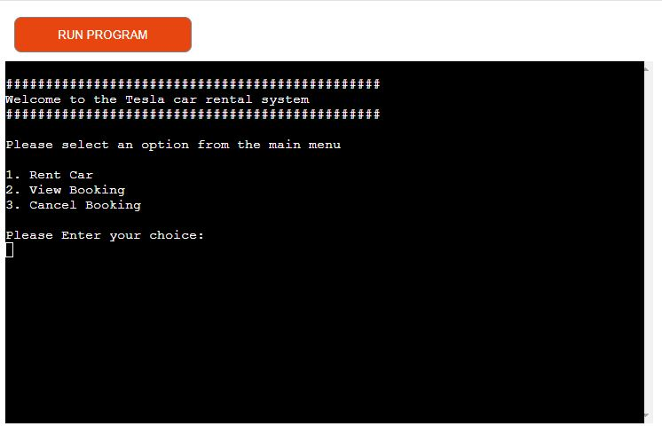
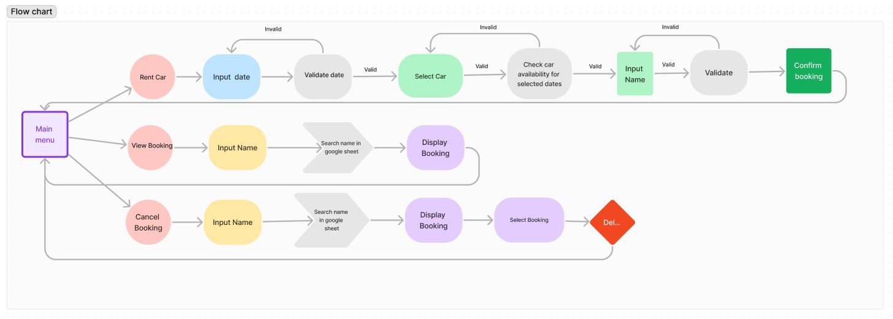
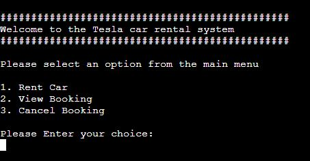
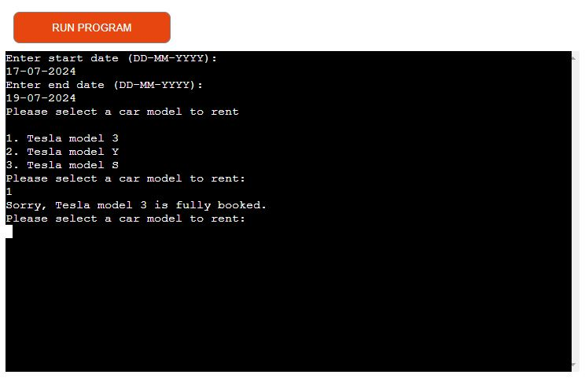
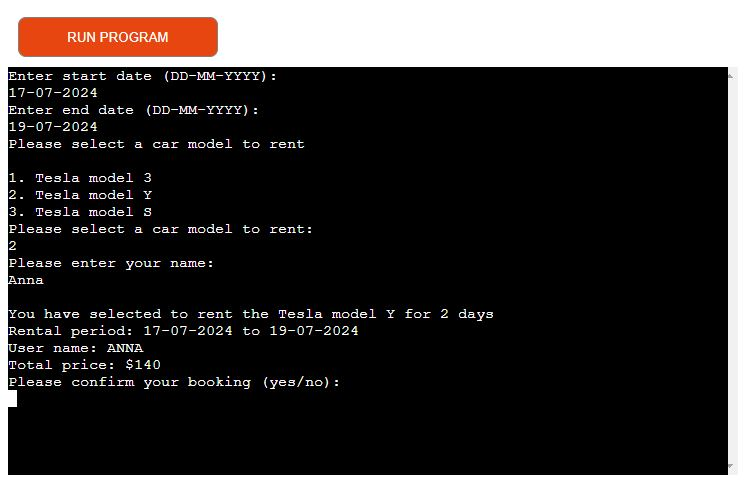
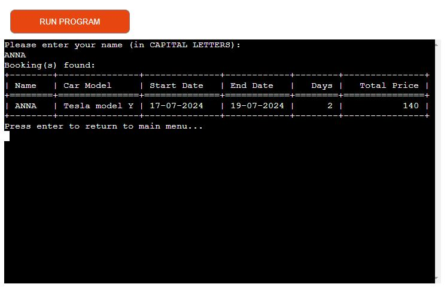

# Tesla

**Tesla** is a CLI data automation program created for educational purposes only as part of the [Code Institute](https://codeinstitute.net/ie/full-stack-software-development-diploma/?utm_term=code%20institute&utm_campaign=CI%2B-%2BIRL%2B-%2BSearch%2B-%2BBrand&utm_source=adwords&utm_medium=ppc&hsa_acc=8983321581&hsa_cam=14304747355&hsa_grp=128775288209&hsa_ad=635725005315&hsa_src=g&hsa_tgt=kwd-319867646331&hsa_kw=code%20institute&hsa_mt=e&hsa_net=adwords&hsa_ver=3&gad_source=1&gclid=Cj0KCQjwwMqvBhCtARIsAIXsZpZC495GdKzsmvgCTZoifPZGwIm_vcoRPwF45OvGEB0qwplfPY2MoZUaAk_MEALw_wcB) Diploma in Full-Stack Software Development.

[Live Preview of Tesla](https://rent-tesla-fbe3f5ee7ebb.herokuapp.com/)

## Table of Contents

- [Tesla](#tesla)
  - [Table of Contents](#table-of-contents)
- [UX](#ux)
  - [User](#user)
  - [User Goals](#user-goals)
  - [User Story](#user-story)
  - [Site owners Goals](#site-owners-goals)
  - [Program flowchart](#program-flowchart)
- [Features](#features)
  - [Existing Features](#existing-features)

# UX

## User

## User Goals

- Rent Tesla car.
- View Booking.
- Cancel booking.

## User Story

- As a  user, I want to be able to rent a Tesla car so that I can use it for my transportation needs.
- As a  user, I want to view my booking details so that I can verify the information.
- As a  user,  I want to cancel my booking if my plans change so that I can avoid unnecessary charges and free up the car for other customers.

## Site owners Goals

- Easy to navigate.
- Provide a diverse selection of Tesla car models and prices.
- Provide feedback or a response to the user when they perform a task or action.
- Implement a reservation system to allow users to schedule car rentals in advance, ensuring availability and convenience.

## Program flowchart

During planning, I created a flowchart of how I wanted program to work and interact. The flowchart was created using [Figma](https://www.figma.com/)

\
&nbsp;
[Back to Top](#table-of-contents)
\
&nbsp;

# Features

## Existing Features

- The Main Menu:
  - Users are greeted and presented with three options to choose from.

\
&nbsp;
[Back to Top](#table-of-contents)
\
&nbsp;

- Rent Car Section:
  - This section allows users to input their desired rental dates (present and future dates) and choose a car model. It also provides feedback if a car is unavailable during those dates. 

  - Displays a summary of booking details and cost.

\
&nbsp;
[Back to Top](#table-of-contents)
\
&nbsp;

- View Booking:
  - This section allows users to search for their booking by entering their name. If the user has booked a car, it will display all information regarding the user's booking.
  

  - If no booking is found for the entered name, it will inform the user accordingly.

\
&nbsp;
[Back to Top](#table-of-contents)
\
&nbsp;

- Cancel Booking:
  - In this section, users are provided with the option to cancel their booking. Users will be prompted to input their name to identify their booking. If a booking is found for the entered name, the system will display all relevant booking information and prompt the user to confirm the cancellation. If confirmed, the booking will be canceled.
  - If no booking is found for the entered name, user will be informed accordingly.