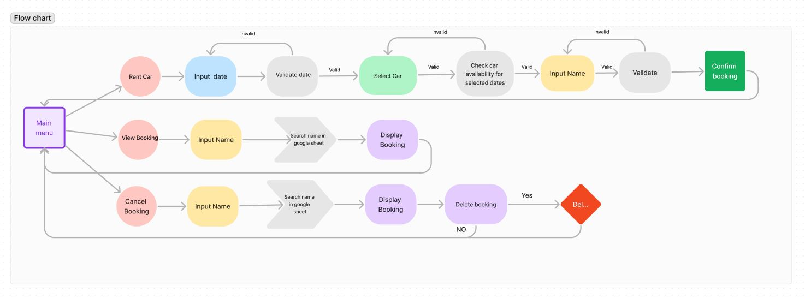
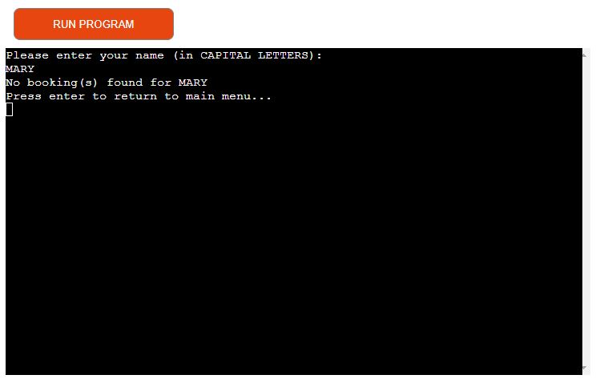
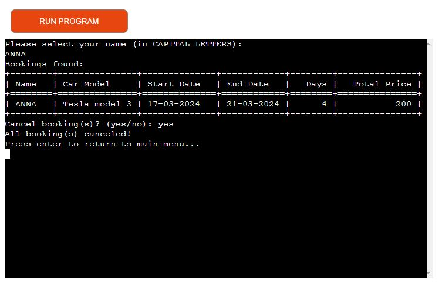

# Tesla

**Tesla** is a CLI data automation program created for educational purposes only as part of the [Code Institute](https://codeinstitute.net/ie/full-stack-software-development-diploma/?utm_term=code%20institute&utm_campaign=CI%2B-%2BIRL%2B-%2BSearch%2B-%2BBrand&utm_source=adwords&utm_medium=ppc&hsa_acc=8983321581&hsa_cam=14304747355&hsa_grp=128775288209&hsa_ad=635725005315&hsa_src=g&hsa_tgt=kwd-319867646331&hsa_kw=code%20institute&hsa_mt=e&hsa_net=adwords&hsa_ver=3&gad_source=1&gclid=Cj0KCQjwwMqvBhCtARIsAIXsZpZC495GdKzsmvgCTZoifPZGwIm_vcoRPwF45OvGEB0qwplfPY2MoZUaAk_MEALw_wcB) Diploma in Full-Stack Software Development.

[Live Preview of Tesla](https://rent-tesla-fbe3f5ee7ebb.herokuapp.com/)

## Table of Contents

- [Tesla](#tesla)
  - [Table of Contents](#table-of-contents)
- [UX](#ux)
  - [User](#user)
  - [User Goals](#user-goals)
  - [User Stories](#user-stories)
  - [Site owners Goals](#site-owners-goals)
  - [Program flowchart](#program-flowchart)
- [Features](#features)
  - [Existing Features](#existing-features)
  - [Future Features](#future-features)
- [Technology used](#technology-used)
- [Testing and Validation](#testing-and-validation)
- [Deployment](#deployment)
  - [Clone the Repository](#clone-the-repository)
  - [APIs](#apis)
  - [Deploying app on Heroku](#deploying-app-on-heroku)
- [Credits](#credits)
- [Acknowledgements](#acknowledgements)

# UX

## User

## User Goals

- Rent Tesla car.
- View Booking.
- Cancel booking.

## User Stories

- As a  user, I want to be able to rent a Tesla car so that I can use it for my transportation needs.
- As a  user, I want to view my booking details so that I can verify the information.
- As a  user,  I want to cancel my booking if my plans change so that I can avoid unnecessary charges and free up the car for other customers.

## Site owners Goals

- Easy to navigate.
- Provide a diverse selection of Tesla car models and prices.
- Provide feedback or a response to the user when they perform a task or action.
- Implement a reservation system to allow users to schedule car rentals in advance, ensuring availability and convenience.

## Program flowchart

During planning, I created a flowchart of how I wanted program to work and interact. The flowchart was created using [Figma](https://www.figma.com/)

\
&nbsp;
[Back to Top](#table-of-contents)
\
&nbsp;

# Features

## Existing Features

- The Main Menu:
  - Users are greeted and presented with three options to choose from.

\
&nbsp;
[Back to Top](#table-of-contents)
\
&nbsp;

- **Rent Car Section:**
  - This section allows users to input their desired rental dates (future dates) and choose a car model. It also provides feedback if a car is unavailable during those dates.
  
  - Displays a summary of booking details and cost.
  

\
&nbsp;
[Back to Top](#table-of-contents)
\
&nbsp;

- **View Booking:**
  - This section allows users to search for their booking by entering their name. If the user has booked a car, it will display all information regarding the user's booking.
  
  - If no booking is found for the entered name, it will inform the user accordingly.
  

\
&nbsp;
[Back to Top](#table-of-contents)
\
&nbsp;

- **Cancel Booking:**
  - In this section, users are provided with the option to cancel their booking. Users will be prompted to input their name to identify their booking. If a booking is found for the entered name, the system will display all relevant booking information and prompt the user to confirm the cancellation. If confirmed, the booking will be canceled.
  
  - If no booking is found for the entered name, user will be informed accordingly.
  

\
&nbsp;
[Back to Top](#table-of-contents)
\
&nbsp;

## Future Features

- Generate Booking IDs:
  - When a user makes a booking, generate a unique booking ID for that reservation.
  - Cancel booking/s by booking id.

# Technology used

- **[HTML](https://www.youtube.com/watch?v=3OTSsq9Y0P4&t=5s)**
- **[CSS](https://www.youtube.com/watch?v=nV9oaUglBTE)**
- **[JavaScript](https://www.youtube.com/watch?v=wm4F0Zqxu5A)**
- **[Python](https://www.youtube.com/watch?v=vRsFb4nMGP4)** Used to create the program.
- **[os Module](https://stackoverflow.com/questions/2084508/clear-the-terminal-in-python)** Used for clearing the terminal.
- **[tabulate Module](https://360digitmg.com/blog/python-tabulate)** Used to present data in a table format.
- **[datetime Module](https://www.programiz.com/python-programming/datetime)** Used for handling date and time operations.
- **[VSCode](https://en.wikipedia.org/wiki/Visual_Studio_Code)** Used to write code.
- **[Google Sheets](https://en.wikipedia.org/wiki/Google_Sheets)** Used to store data.
- **[gspread](https://github.com/burnash/gspread)** Used to allow the Python program to interact with Google Sheets.
- **[google.oauth2.service_account Credentials](https://google-auth.readthedocs.io/en/latest/reference/google.oauth2.service_account.html#google.oauth2.service_account.Credentials)**: Used for authentication with Google APIs using service account credentials.
- **[Heroku](https://www.heroku.com/)** Used to deploy the project.
- **[GitHub](https://en.wikipedia.org/wiki/GitHub)** Version control and repository hosting.
- **[Git](https://en.wikipedia.org/wiki/Git)** - Version control system used to commit and push code during development.
- **[Figma](https://www.figma.com/)** - Used to create the flowchart.
- **[pep8ci](https://pep8ci.herokuapp.com/)** Used to check python code for errors.

\
&nbsp;
[Back to Top](#table-of-contents)
\
&nbsp;

# Testing and Validation

- **Functional Testing:**

|Test scenario|Steps|Observation| Pass/Fail |
|-------------|------------------|-----------|-------|
|Main Menu - selecting options| 1.Input letters. 2.Input letters, numbers, and symbols. 3.Input letters '1', '2', and '3'. 4.Input numbers greater than '3'.|1.Program should prompt to enter a number between '1' and '3'. 2.Program should prompt to enter a number between '1' and '3'. 3.Program should navigate to the selected option. 4.Program should prompt to enter a number between '1' and '3'.|1.Pass 2.Pass 3.Pass 4.Pass|
|Rent Car - selecting start date|1.Input letters. 2.Input letters, numbers, and symbols. 3.Input past dates. 4.Input the current date. 5. Input future dates.|1.Program should prompt to enter a valid date. 2.Program should prompt to enter a valid date. 3.Program should prompt to enter a valid date. 4.Program should prompt to enter a valid date. 5.Program should prompt to enter the end date.|1.Pass 2.Pass 3.Pass 4.Pass 5.Pass|
|Rent Car - selecting end date|1.Input letters. 2.Input letters, numbers, and symbols. 3.Input past dates. 4.Input the current date. 5.Input the start date. 6.Input dates greater than the start date.|1.Program should prompt to enter a valid date. 2.Program should prompt to enter a valid date. 3.Program should prompt to enter a valid date. 4.Program should prompt to enter a valid date. 5.Program should prompt to enter a valid date. 6.Program should display car models to select.|1.Pass 2.Pass 3.Pass 4.Pass 5.Pass 6.Pass|
|Rent Car - selecting car model|1.Input letters. 2.Input letters, numbers, and symbols. 3.Input the letters '1', '2', and '3'. 4.Input numbers greater than '3'.|1.Program should display: "Invalid choice. Please select a valid number." and prompt to select a car model. 2.Program should display: "Invalid choice. Please select a valid number." and prompt to select a car model. 3.Program should prompt to enter the user's name. 4.Program should display: "Invalid choice. Please select a valid number." and prompt to select a car model.|1.Pass 2.Pass 3.Pass 4.Pass|
|Rent Car - enter user name|1.Input numbers. 2.Input numbers, letters, and symbols. 3.Input letters only.|1.Program should display: "Name should contain only letters." and prompt to enter a name. 2.Program should display: "Name should contain only letters." and prompt to enter a name. 3.Program should display the booking details.|1.Pass 2.Pass 3.Pass|
|View Booking - enter user name|1.Input numbers. 2.Input numbers, letters, and symbols. 3.Input lowercase letters. 4.Input capital letters only|1.Program should display: "Name should contain only uppercase letters." and prompt to enter a name. 2.Program should display: "Name should contain only uppercase letters." and prompt to enter a name. 3.Program should display: "Name should contain only uppercase letters." and prompt to enter a name. 4.Program should display user's booking details.|1.Pass 2.Pass 3.Pass 4.Pass|
|Cancel booking - enter user name|1.Input numbers. 2.Input numbers, letters, and symbols. 3.Input lowercase letters. 4.Input capital letters only.|1.Program should display: "Name should contain only uppercase letters." and prompt to enter a name. 2.Program should display: "Name should contain only uppercase letters." and prompt to enter a name. 3.Program should display: "Name should contain only uppercase letters." and prompt to enter a name. 4.Program should display user's booking details.|1.Pass 2.Pass 3.Pass 4.Pass|
|Cancel booking - users booking data display|1.Enter the user's name with no booking. 2.Enter the user's name with booking.|1.Program should display: "No booking found for USER." 2.Program should display users booking and ask user to cancel booking(s) (yes/no).|1.Pass 2.Pass|
|Cancel booking - yes/no confirmation|1.Input numbers. 2.Input letters, numbers, and symbols. 3.Input yes. 4.Input no.|1.Program should display: "Invalid input. Please enter 'yes' or 'no'." and prompt the user to enter yes/no. 2.Program should display: "Invalid input. Please enter 'yes' or 'no'." and prompt the user to enter yes/no. 3.Program should return to the main menu. 4.Program should display: "Booking cancelation canceled."|1.Pass 2Pass 3.Pass 4.Pass|

\
&nbsp;
[Back to Top](#table-of-contents)
\
&nbsp;

- **Testing User Stories**

|User Stories|Pass/Fail|
|-------------|------------------|
|As a  user, I want to be able to rent a Tesla car so that I can use it for my transportation needs.|Pass|
|As a  user, I want to view my booking details so that I can verify the information.|Pass|
|As a  user,  I want to cancel my booking if my plans change so that I can avoid unnecessary charges and free up the car for other customers.|Pass|

\
&nbsp;
[Back to Top](#table-of-contents)
\
&nbsp;

- **Validator Testing**
  - **Python** No error were found passing through the [pep8ci](https://pep8ci.herokuapp.com/)

\
&nbsp;
[Back to Top](#table-of-contents)
\
&nbsp;

# Deployment

## Clone the Repository

Navigate to the GitHub Repository you want to clone to use locally:

1. Click on the code drop down button
2. Click on HTTPS
3. Copy the repository link to the clipboard
4. Open your IDE of choice
5. Type git clone copied-git-url into the IDE terminal

The project will now be cloned on your local machine for use.

\
&nbsp;
[Back to Top](#table-of-contents)
\
&nbsp;

## APIs

For setting up APIs I falowed videos and instructions provided in Love Sandwiches and [
Spreadsheet Point](https://www.youtube.com/watch?v=-vBbkrk9sdA&list=LL&index=12&t=802s).

**APIs used for this project:**

- Google Drive API.
- Google Sheet API.

\
&nbsp;
[Back to Top](#table-of-contents)
\
&nbsp;

## Deploying app on Heroku

1. **Update requirements.txt file**:
   - In your IDE, run the command: `pip3 freeze > requirements.txt` to include all dependencies.
   - Commit the changes and push to GitHub.
2. **Log in to Heroku**:
   - Access your Heroku account.
3. **Create new app**:
   - From the dashboard, click "New" (top right corner) and choose "Create new app".
   - Provide a unique name for your app (e.g., "rent-tesla") and select your preferred region (e.g., Europe).
   - Click "create app".
4. **Configure environment variables**:
   - Navigate to the settings tab, find "Config Vars", and click "Reveal config vars".
   - Add a config var:
     - KEY: `CREDS`
     - VALUE: Copy and paste the contents of your creds.json file.
   - Add another config var:
     - KEY: `PORT`
     - VALUE: `8000`.
5. **Set up buildpacks**:
   - Scroll to the "Buildpacks" section and click "Add buildpack".
   - Select Python as the first buildpack and save changes.
   - Add another buildpack:
     - Select Node.js.
     - Save changes again.
     - Ensure that the Python buildpack is positioned above the Node.js buildpack.
6. **Connect to GitHub**:
   - Navigate to the "Deploy" section by clicking the "Deploy" tab.
   - Choose "GitHub" as the deployment method and click "Connect to GitHub".
   - Search for your GitHub repository and click "Connect".
7. **Deploy the app**:
   - Scroll down and click "Deploy Main".
8. **View deployed app**:
   - Once the app is deployed, Heroku will notify you and provide a button to view the app.

\
&nbsp;
[Back to Top](#table-of-contents)
\
&nbsp;

# Credits

- **[Tech Coffee Break
](https://www.youtube.com/watch?v=WtBT2U3okvA&list=LL&index=6&t=57s)** used to create virtual environment for Python in VS Code.
- **Love Sandwiches** and **[
Spreadsheet Point](https://www.youtube.com/watch?v=-vBbkrk9sdA&list=LL&index=12&t=802s)**  used how to create and link APIs.
- **[Stackoverflow](https://stackoverflow.com/questions/2084508/clear-the-terminal-in-python)** used to clear Python terminal.
- **[Stackoverflow](https://stackoverflow.com/questions/70532876/no-module-named-tabulate-0-8-9)** used to import tabulate.
- **[Programiz](https://www.programiz.com/python-programming/datetime)** used to import datetime.
- **[Ammon Quarshie](https://www.youtube.com/watch?v=KE04NP5luLY&t=1s)** used for project insparation.

# Acknowledgements

- The Code Institute community and my Cohort Facilitator **Laura Mayock**, for motivation and support.
- My mentor, **Gareth McGirr**, for providing me with information and advices through the development process.

\
&nbsp;
[Back to Top](#table-of-contents)
\
&nbsp;